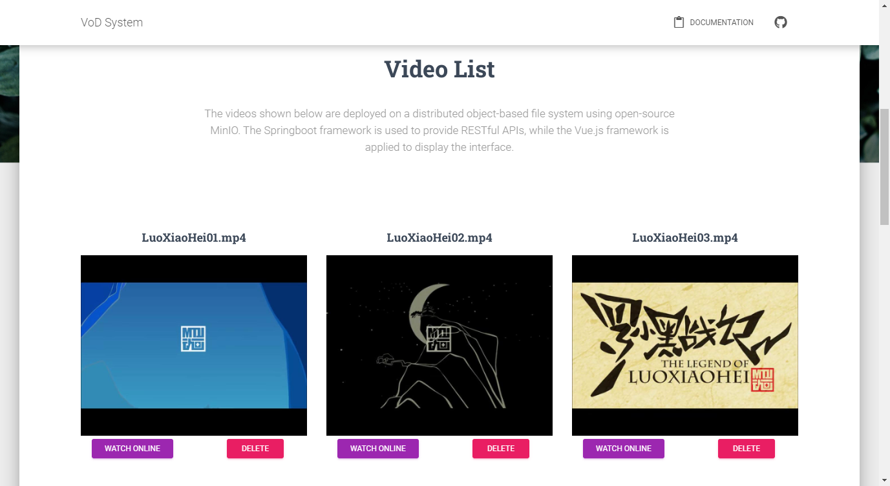

# VoD
Video on Demand Service based on MinIO, SpringBoot, and Vue.js

- Author: Junyi Cao
- Email: junyicao@sjtu.edu.cn
- Last Modified Time: June 21, 2022

### MinIO deployment
- Download MinIO and start the service on the default port.

### Backend deployment
- The code for backend compoent is placed under `VOD` directory.
- Specify the endpoint, access key, and secret key of MinIO service in the `application.properties`.
- Start the SpringBoot service.

### Frontend deployment
- Change directory into `VOD_GUI`.
- Run `npm install`.
- Run `npm run dev`.
